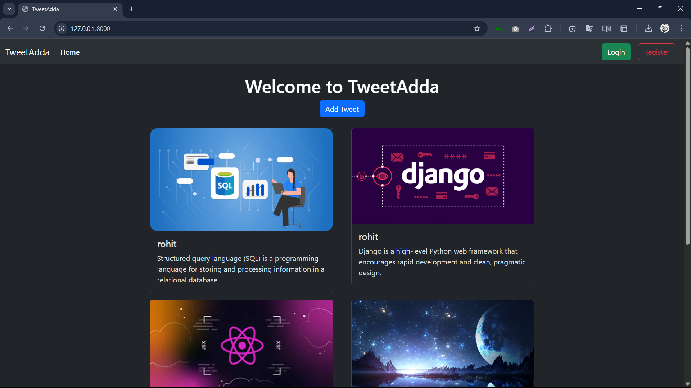
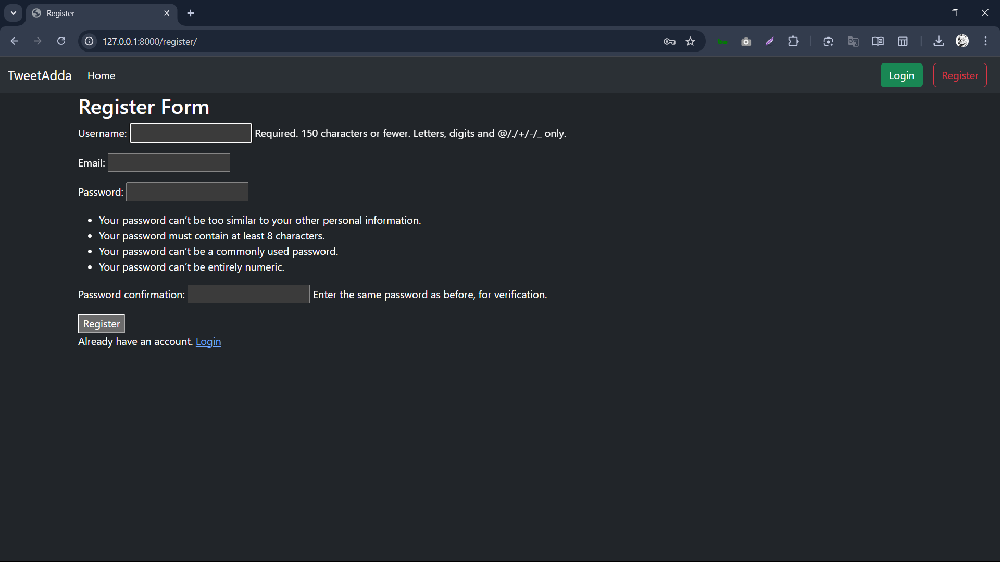
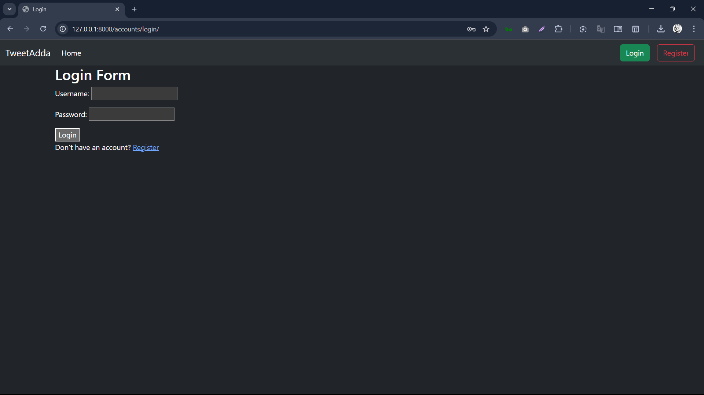
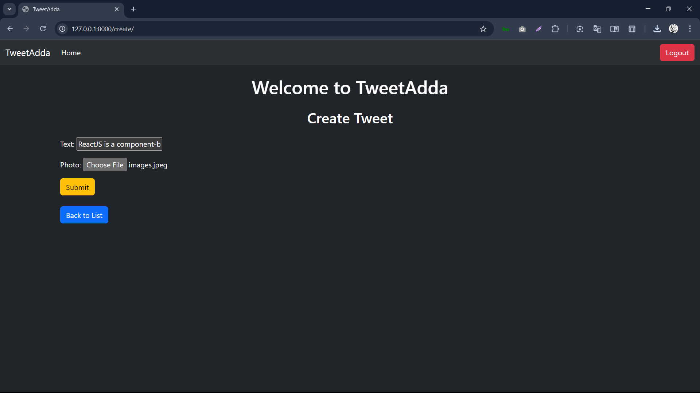

# TweetAdda 🐦

A mini Twitter-like web app built using **Django** where users can create, view, edit, and delete tweets. It supports **user authentication**, image uploads with tweets, and uses **Bootstrap 5** for a responsive UI.

---
```

## 🚀 Features

- User Registration, Login & Logout
- Create, Edit, Delete your own Tweets
- Upload Image with Tweet
- View all Tweets sorted by latest
- Beautiful UI with Bootstrap 5
- Dark Theme Support
```

## 📸 Screenshots









---
## 🔧 Tech Stack

- **Backend**: Django
- **Frontend**: HTML, CSS, Bootstrap 5
- **Database**: SQLite (default)
---

## ⚙️ Setup Instructions

### 1️⃣ Clone the repository:
```bash
git clone https://github.com/your-username/tweetadda.git
cd tweetadda
```

### 2️⃣ Create a virtual environment:

```bash
python -m venv venv
source venv/bin/activate     # On Windows: venv\Scripts\activate
```

### 3️⃣ Install dependencies:

```bash
pip install -r requirements.txt
```

### 4️⃣ Apply migrations:

```bash
python manage.py migrate
```

### 5️⃣ Create superuser (optional):

```bash
python manage.py createsuperuser
```

### 6️⃣ Run the development server:

```bash
python manage.py runserver
```

Visit: [http://127.0.0.1:8000](http://127.0.0.1:8000)


---

### 📌 Default URLs

| URL Path                    | Description                  |
|----------------------------|------------------------------|
| `/`                        | Home Page / View All Tweets  |
| `/create/`                 | Create Tweet                 |
| `/<id>/edit/`              | Edit Tweet                   |
| `/<id>/delete/`            | Delete Tweet                 |
| `/accounts/login/`         | User Login                   |
| `/accounts/logout/`        | User Logout                  |
| `/register/`               | User Registration            |

---

## 🔐 Authentication Settings in `settings.py`

```python
LOGIN_URL = 'login'
LOGIN_REDIRECT_URL = 'tweet_list'
LOGOUT_REDIRECT_URL = 'index'
```
---

## 📦 Dependencies

Make sure you have the following in your `requirements.txt`:

## 📝 Future Improvements

- Add Tweet Likes or Comments
- User Profiles
- Pagination
- Tweet Search
- Responsive improvements

---